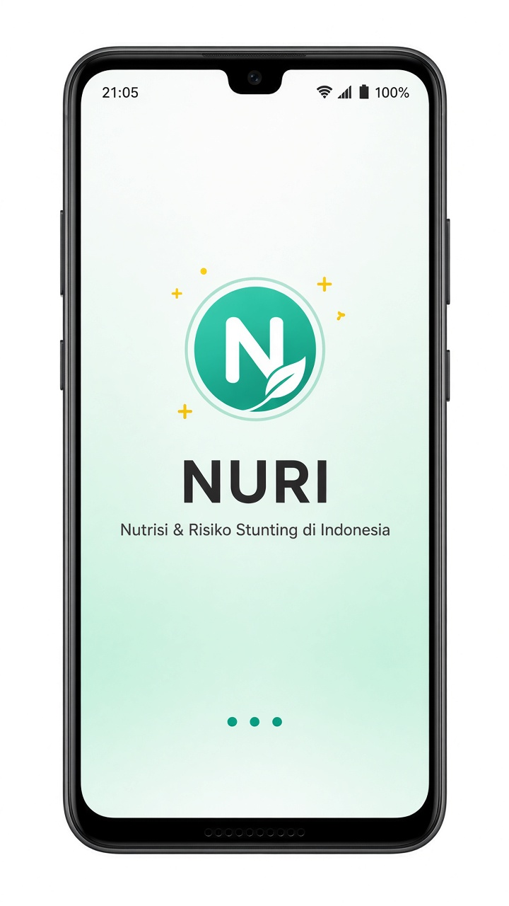

# LAPORAN AWAL TUGAS KELOMPOK

**Mata Kuliah:** Pemrograman Mobile  
**Judul Tugas:** Satu layar untuk proyek  

---

## Identitas Kelompok

| | |
|---|---|
| **Nama Kelompok** | Free Fire |
| **Anggota** | 1. 241401030 — Frito Radestya. S |
| | 2. 241401072 — Akief Maulana Aulia |
| **Nama Aplikasi** | **NURI** (Nutrisi & Risiko Stunting di Indonesia) |
| **Layar yang dikerjakan** | Splash Screen (layar pembuka) |
| **Teknologi** | Flutter (Dart) |

---

## 1. Ide Aplikasi (Ringkas)

**NURI** adalah aplikasi mobile berbasis AI yang membantu keluarga dan kader Posyandu mencegah stunting. Melalui foto, NURI dapat menganalisis kandungan gizi makanan (basis data Kemenkes RI) dan mendeteksi risiko stunting balita secara non-invasif mengacu standar WHO.

Pada tahap laporan awal ini, kelompok mengimplementasikan **satu layar**: **Splash Screen** sebagai identitas merek dan pintu masuk aplikasi.

---

## 2. Pengguna dan Tujuan Halaman

### 2.1 Pengguna target (untuk layar ini)

| Aspek | Keterangan |
|--------|------------|
| **Pengguna utama** | Ibu balita (20–40 tahun) dan kader Posyandu |
| **Konteks** | Membuka aplikasi untuk pertama kali / setiap sesi |
| **Kebutuhan** | Mengenali identitas aplikasi dengan cepat, merasa aman & terpercaya (tema kesehatan) |

### 2.2 Satu tujuan halaman

> **Tujuan Splash Screen:** memperkenalkan identitas merek **NURI** secara singkat (logo + nama + tagline), memberi kesan profesional dan ramah, lalu mengarahkan pengguna ke layar Login.

Halaman ini **bukan** untuk input data atau fitur AI — hanya branding dan transisi awal.

---

## 3. Wireframe Halaman

Wireframe disusun sederhana (bisa digambar ulang di kertas/Figma jika diminta dosen).

```
┌─────────────────────────────┐
│         status bar          │
│                             │
│      (blob dekoratif)       │
│                             │
│         ┌───────┐           │
│         │ orbit │           │
│         │  ○○   │  ← logo   │
│         │  N +  │    animasi│
│         │ daun  │           │
│         └───────┘           │
│                             │
│           NURI              │
│   Nutrisi & Risiko Stunting │
│        di Indonesia         │
│                             │
│   Cegah stunting lebih dini │
│                             │
│                             │
│          ● ● ●              │
│      (loading dots)         │
└─────────────────────────────┘
```

### Keterangan elemen wireframe

| No | Elemen | Fungsi |
|----|--------|--------|
| 1 | Background gradient | Suasana tenang, warna kesehatan (teal muda → putih) |
| 2 | Logo NURI (4 bagian) | Badge, huruf N, daun, spark — identitas visual |
| 3 | Ring orbit | Aksen “loading / proses” |
| 4 | Judul **NURI** | Nama aplikasi |
| 5 | Tagline | Menjelaskan makna singkat aplikasi |
| 6 | Loading dots | Indikator bahwa aplikasi sedang memuat |

---

## 4. Implementasi UI Flutter (Statis + Animasi Ringan)

### 4.1 File terkait

| File | Peran |
|------|--------|
| `lib/main.dart` | Entry point app (`NuriApp`) |
| `lib/screens/splash_screen.dart` | Layar Splash |
| `lib/widgets/animated_splash_logo.dart` | Logo NURI + animasi per bagian |
| `lib/theme/app_colors.dart` | Palet warna |

### 4.2 Struktur widget (uraian singkat)

```
SplashScreen (StatefulWidget)
 └── Scaffold
      └── AnimatedBuilder          ← animasi background
           └── Container (gradient)
                └── Stack
                     ├── blob dekoratif (3× Container)
                     └── SafeArea
                          └── Column
                               ├── Spacer
                               ├── Stack
                               │    ├── SplashOrbitRing
                               │    └── AnimatedSplashLogo
                               │         ├── NuriLogoBadge      (1)
                               │         ├── NuriLogoLetter     (2)
                               │         ├── NuriLogoLeaf       (3)
                               │         └── NuriLogoSpark      (4)
                               ├── AnimatedBrandText  (“NURI” + tagline)
                               ├── Text hint
                               ├── Spacer
                               └── _SplashLoadingDots
```

**Inti desain:** logo dipecah menjadi **4 container/widget terpisah** agar tiap bagian bisa dianimasikan sendiri (scale, fade, rotate, bounce).

### 4.3 Cuplikan alur kode (ringkas)

1. `main.dart` menjalankan `NuriApp` → `home: SplashScreen()`.
2. `SplashScreen` membuat `AnimationController` untuk brand, orbit, dan background.
3. Setelah ±3,4 detik, navigasi `pushReplacement` ke `LoginScreen` dengan fade.
4. `AnimatedSplashLogo` menganimasikan badge → huruf N → daun → spark secara berurutan.

---

## 5. Screenshot

**Gambar 1.** Splash Screen aplikasi NURI (tampilan mobile)



**File gambar:** `assets/laporan/nuri_splash_laporan.png`

**Keterangan gambar:** Tampilan Splash Screen NURI menampilkan logo (badge, huruf N, daun, spark), nama aplikasi, tagline, dan indikator loading pada perangkat mobile.

> *Opsional:* ganti dengan screenshot asli dari emulator Android Studio agar 100% sesuai hasil run kelompok.

---

## 6. Hasil Review Antaranggota (isi singkat)

| Aspek | Catatan review | Status |
|--------|----------------|--------|
| Kesesuaian dengan ide NURI | Nama & tagline sesuai SRS | OK |
| Keterbacaan teks | Font Poppins, kontras cukup | OK |
| Identitas visual | Warna teal + daun (nutrisi) | OK |
| Perbaikan | (isi jika ada masukan anggota) | — |

*Diisi bersama saat review kelompok.*

---

## 7. Kesimpulan Tahap Awal

Pada laporan awal ini, kelompok Free Fire telah:

1. Menentukan **pengguna** (ibu balita / kader) dan **satu tujuan halaman** (branding NURI).  
2. Menyusun **wireframe** Splash Screen.  
3. Mengimplementasikan UI Flutter pada `SplashScreen` + logo modular `AnimatedSplashLogo`.  
4. Menyiapkan **screenshot**, **kode sumber**, dan **uraian struktur widget**.

Tahap berikutnya: pengembangan layar fungsional utama (Login / Home) sesuai Mini SRS.

---

## Lampiran A — Cara menjalankan

```bash
flutter pub get
flutter run
```

Pastikan emulator Android sudah **Cold Boot** dan siap sebelum Run di Android Studio.

## Lampiran B — Referensi SRS

Dokumen lengkap: `Mini SRS Kelompok Free Fire.md`  
Nama aplikasi: **NURI** — Nutrisi & Risiko Stunting di Indonesia.
